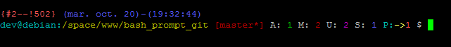

Bash Prompt Git
===============

Customed bash prompt

Features:
 * the history number of this command
 * the command number of this command
 * the date  in  "Weekday  Month  Date"  format (e.g., "Tue May 26")
 * the current time in 24-hour HH:MM:SS format
 * the username of the current user
 * the hostname up to the first `.'
 * the current working directory
 * GIT branch display with sync
 * GIT counter of added, modified, deleted, untracked and stashed files
 * GIT signalization about of ahead/behind remote repository
 * GIT counter of commits about ahed/behind remote repository

Exemple prompt without git


Exemple prompt git



INSTALLATION
============

Run back bash* files
```
    mkdir ~/backup-files
    cp -rfp ~/.bash* ~/backup-files/
```

Copy all '.bash' files to your home directory
```
    git clone git@github.com:silverpark/bash_prompt_git.git
    cd bash_prompt_git
    cp -rfp ./.bash* ~/
    cat .install >> ~/.bashrc
```
